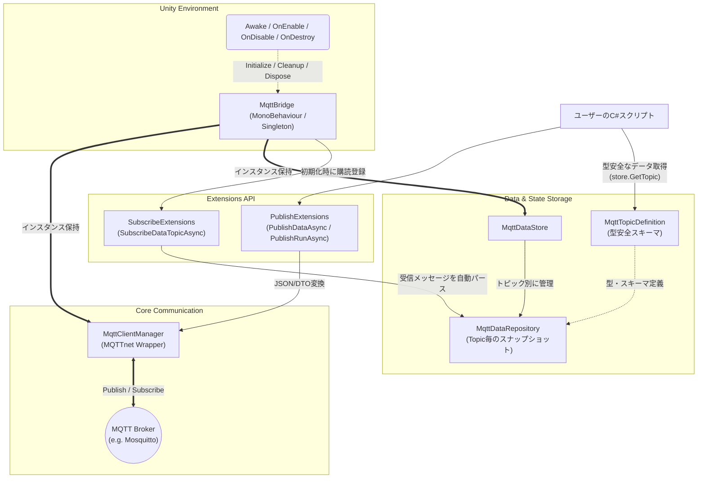

# Unity MQTT Client

Unity Package Manager 対応の最小限 MQTT 送受信パッケージ。  
[MQTTnet](https://github.com/dotnet/MQTTnet) v3.1.2 を使用。
通信処理はバックグラウンドで行われ、メインスレッドへのディスパッチは利用者が明示的に制御できる設計です。

## 特徴

- **型安全なデータアクセス**: `MqttTopicDefinition` でトピックのデータスキーマを定義し、IDE 補完と型チェックを享受
- **マルチトピック対応**: トピックごとに独立した `MqttDataRepository` を生成
- **高精度タイムスタンプ**: 各データアイテムごとに「送信元生成時刻」と「Unity 受信時刻」を保持
- **柔軟な Publish**: 汎用 JSON、PLC コマンド、および Subscribe 互換形式でのデータ送信に対応
- **スレッドモデルの最適化**: 通信・内部パースはすべてバックグラウンドで処理され、メインスレッドへの不要なコンテキストスイッチを最小化

## 前提条件

### UniTask

このパッケージは [UniTask](https://github.com/Cysharp/UniTask) に依存しています。  
パッケージ導入前に、`Packages/manifest.json` の `dependencies` に以下を追加してください:

```json
"com.cysharp.unitask": "https://github.com/Cysharp/UniTask.git?path=src/UniTask/Assets/Plugins/UniTask",
"com.cysharp.r3": "https://github.com/Cysharp/R3.git?path=src/R3.Unity/Assets/R3.Unity"
```

## 導入方法

### Package Manager から導入

1. Unity エディタで **Window → Package Manager** を開く
2. **+ → Add package from git URL...** を選択
3. 以下の URL を入力:

```
https://github.com/Toshi-0515/unity-mqtt.git
```

## 使い方

### 1. トピック定義を作成する

受信したいトピックのデータスキーマを `MqttTopicDefinition` を継承して定義します。  
`MqttField<T>` はpublic readonlyにしてフィールド名は、受信する JSON ペイロードの `"name"` と一致させてください。

```csharp
public class PlcDevice1Topic : MqttTopicDefinition
{
    public override string TopicPath => "plc/device1";

    public readonly MqttField<int>   Rotation  = new("Rotation");
    public readonly MqttField<float> Speed     = new("Speed");
    public readonly MqttField<bool>  IsRunning = new("IsRunning");
}
```

### 2. 受信のセットアップ

`MqttBridge` コンポーネントをアタッチし、インスペクターでブローカー IP と購読したいトピックのリスト（`Topics`）を設定します。

トピック文字列（例: `"plc/device1"`）は、定義クラスの `TopicPath` と一致させてください。

### 3. データ取得

`store.GetTopic<T>()` で型安全なトピックインスタンスを取得し、フィールドにアクセスします。

```csharp
var store = MqttBridge.Instance.Store;
var topic = store.GetTopic<PlcDevice1Topic>();

// 値のみを取得
int rot = topic.Rotation.Value;

// TryGet パターン
if (topic.Rotation.TryGetValue(out var rotation))
{
    Debug.Log($"Rotation: {rotation}");
}

// タイムスタンプ付き（デジタルツイン・死活監視用）
var entry = topic.Speed.Entry;
if (entry != null)
{
    Debug.Log($"Speed: {entry.Value}");
    Debug.Log($"ソース時刻: {entry.SourceTimestampUtc}");
    Debug.Log($"Unity受信時刻: {entry.ReceivedUtc}");
    Debug.Log($"データの鮮度 (秒): {entry.Age.TotalSeconds}");
}
```

### 4. データ送信（DataPublish）

Subscribe 側と同じ形式（`MqttDataEnvelope`）でデータを送信します。

```csharp
var manager = MqttBridge.Instance.Manager;

// 単一値の送信
await manager.PublishDataAsync("unity/data", "Status", "Running");

// 特定のトピックの内容をそのままミラー送信
var topic = store.GetTopic<PlcDevice1Topic>();
await manager.PublishDataAsync(topic.Repository, topic: "cloud/mirror");
```

### 5. PLC コマンド送信

```csharp
await manager.PublishRunAsync("motor/cmd", frequency: 60, direction: 0);
await manager.PublishStopAsync("motor/cmd");
```

### 6. システムアーキテクチャ



## API リファレンス

本ライブラリは `MqttClientManager` を中心に、用途に応じた各種拡張メソッドを提供しています。名前空間はすべて拡張対象と同じものになり、そのまま呼び出すことができます。

### 0. コア API (`MqttClientManager`)

本ライブラリの通信の核となるクラスです。MQTTnet の複雑な設定を隠蔽し、スレッド管理は上位レイヤーに委譲する設計で、基本となる Subscribe / Publish メソッドを提供します。以下は拡張メソッドを使わずに直接コア機能を利用する場合の例です。

#### `SubscribeAsync`
指定したトピックを購読します。データを受信すると、バックグラウンドスレッドでハンドラーが呼ばれます。

> [!NOTE]
> 現在の `SubscribeAsync` は完全一致トピックのみをサポートしています。`sensor/#` や `sensor/+` のようなワイルドカード購読は未実装です。

```csharp
var manager = MqttBridge.Instance.Manager;

// 完全一致するトピックを購読し、独自の受信処理を定義する
await manager.SubscribeAsync("sensor/temp", (topic, payloadBytes) =>
{
    // メニューやUI（Unity MainThread）などを操作する場合は
    // UniTask.Post() 等を用いてコンテキストを切り替えてください
    UniTask.Post(() =>
    {
        var text = System.Text.Encoding.UTF8.GetString(payloadBytes);
        Debug.Log($"[Received] {topic}: {text}");
    });
});
```

#### `PublishAsync`
生のバイト配列（`byte[]`）を任意のトピックに送信します。QoS レベルや Retain（保持）フラグの指定も可能です。

```csharp
byte[] data = new byte[] { 0x00, 0xFF, 0x0A };

// QoS 1 (AtLeastOnce) と Retain フラグを指定して送信する
await manager.PublishAsync(
    "raw/topic", 
    data, 
    qos: MQTTnet.Protocol.MqttQualityOfServiceLevel.AtLeastOnce, 
    retain: true
);
```

### 1. データ受信用拡張メソッド (`MqttSubscribeExtensions`)

`MqttDataEnvelope` （タイムスタンプとアイテムリストを持つ標準 JSON フォーマット）として送られてくるデータを受信し、状態管理システムへ流し込みます。

#### `SubscribeDataTopicAsync`
指定したトピックを購読し、受信した MQTT メッセージをパースして自動的に `MqttDataStore` へ反映させます。内部リポジトリはスレッドセーフ（lock保護）なため安全にバックグラウンドで処理されます。

```csharp
var manager = MqttBridge.Instance.Manager;
var store = MqttBridge.Instance.Store;

// "plc/device1" トピックの購読を開始
await manager.SubscribeDataTopicAsync("plc/device1", store);
```

> [!WARNING]
> 受信イベントフックでUnityメインスレッドなどへのアクセスが必要な場合は、利用者側で処理をディスパッチしてください。

### 2. データ送信用拡張メソッド (`MqttDataPublishExtensions`)

`MqttDataEnvelope` 形式でデータを送信（Publish）するためのメソッド群です。デジタルツイン構築やデータの死活監視で主に利用されます。すべてのメソッドのシグネチャは `PublishDataAsync` で統一されており、オプション引数として QoS (`qos`) と Retain (`retain`) フラグを自由に設定できます。

#### ① 単一キー・値の送信
最も手軽に1つのデータポイントを送信するオーバーロードです。`Timestamp` は現在時刻が自動付与されます。

```csharp
// topic: "sensor/temp", name: "Temperature", value: 25.5
await manager.PublishDataAsync("sensor/temp", "Temperature", 25.5f);

// QoS 1 (AtLeastOnce) と Retain フラグを指定して送信する場合
await manager.PublishDataAsync(
    "sensor/temp", 
    "Temperature", 
    25.5f, 
    qos: MQTTnet.Protocol.MqttQualityOfServiceLevel.AtLeastOnce,
    retain: true
);
```

#### ② 辞書（Dictionary）からの送信
複数のデータポイントを一気に送信するオーバーロードです。

```csharp
var data = new Dictionary<string, object>
{
    { "Rotation", 100 },
    { "IsRunning", true },
    { "Speed", 4.5f }
};

await manager.PublishDataAsync("robot/status", data);
```

#### ③ `MqttDataItem` のリストからの送信
あらかじめ構成されたアイテムリストから送信します。

```csharp
var items = new List<MqttDataItem>
{
    new MqttDataItem { Name = "Battery", Value = 80 },
    new MqttDataItem { Name = "Mode", Value = "Auto" }
};

await manager.PublishDataAsync("drone/info", items);
```

#### ④ エントリ辞書（`MqttDataEntry`）からの送信
内部で保持しているタイムスタンプ情報などを含む辞書から送信します。タイムスタンプは最新の `SourceTimestampUtc` が採用されます。

```csharp
// Storeから取り出したデータをそのまま送信する場合などに利用
IReadOnlyDictionary<string, MqttDataEntry> entries = GetEntries();
await manager.PublishDataAsync("mirror/topic", entries);
```

#### ⑤ リポジトリ（`MqttDataRepository`）のスナップショットの送信
あるトピックが保持している現在の完全な状態（スナップショット）をごっそり他へ転送（ミラー処理）する場合に便利です。

```csharp
var topicData = store.GetTopic<PlcDevice1Topic>();

// 取得元のトピック "plc/device1" 宛にそのまま現状を再送信
await manager.PublishDataAsync(topicData.Repository);

// トピック名を "cloud/device1_mirror" と上書きして送信
await manager.PublishDataAsync(topicData.Repository, topic: "cloud/device1_mirror");
```

#### ⑥ `MqttDataEnvelope` を直接送信
タイムスタンプや中身を細かくカスタマイズして送信したい場合に利用します。

```csharp
var envelope = new MqttDataEnvelope
{
    Timestamp = "2024-05-15T12:00:00Z", // 過去の日付などを指定可能
    Items = new List<MqttDataItem> { /* ... */ }
};

await manager.PublishDataAsync("custom/sys", envelope);
```

### 3. PLC 専用コマンド拡張メソッド (`MqttPlcCommandPublishExtensions`)

モーターやコンベアといった機器に対し、`{"command": "...", "freq": ..., "dir": ...}` のフォーマットで JSON コマンドを送信するショートカットです。

#### `PublishRunAsync`
機器の起動（RUN）コマンドを送信します。周波数（0-120）と方向（0:正転, 1:逆転）を同時に指定可能です。

```csharp
// 60Hz で正転起動
await manager.PublishRunAsync("motor/cmd", frequency: 60, direction: 0);
```

#### `PublishStopAsync`
機器の停止（STOP）コマンドを送信します。

```csharp
await manager.PublishStopAsync("motor/cmd");
```

#### `PublishSetFreqAsync` / `PublishSetDirAsync`
それぞれ周波数、回転方向のみを変更するコマンドを送信します。

```csharp
await manager.PublishSetFreqAsync("motor/cmd", frequency: 50);
await manager.PublishSetDirAsync("motor/cmd", direction: 1);
```

### 4. 汎用送信用拡張メソッド (`MqttPublishExtensions`)

独自のクラスや任意の文字列、未加工のバイトデータを送信したい場合はこちらを利用します。

#### `PublishAsync<T>`
任意の C# オブジェクトを `Newtonsoft.Json` を用いて JSON 文字列へシリアライズし、送信します。QoS レベルや Retain（保持）フラグの指定も可能です。

```csharp
public class CustomPayload
{
    public string MessageId { get; set; }
    public string Action { get; set; }
}

var payload = new CustomPayload 
{ 
    MessageId = "001", 
    Action = "Reset" 
};

// QoS 1 (AtLeastOnce) で送信し、Retain を true にする
await manager.PublishAsync(
    "system/alert", 
    payload, 
    qos: MQTTnet.Protocol.MqttQualityOfServiceLevel.AtLeastOnce, 
    retain: true
);
```

#### `PublishRawAsync`
文字列や JSON ではなく、生の `byte[]` 配列をそのまま直接 Publish します。音声データや画像などのバイナリ送信、あるいは独自プロトコルの送受信に利用します。

```csharp
byte[] rawData = new byte[] { 0x01, 0xFF, 0x0A, 0x0B };

await manager.PublishRawAsync("binary/stream", rawData);
```

## ライセンス

MIT License
